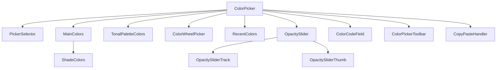

# FlexColorPicker architecture

Durable notes for agents working in `lib/`. SDK versions and lint numbers live in `pubspec.yaml` and `analysis_options.yaml` — do not copy them here. Consume-side usage: [.agents/skills/flex-color-picker/SKILL.md](../../.agents/skills/flex-color-picker/SKILL.md). How to change the package: [.agents/skills/package-development/SKILL.md](../../.agents/skills/package-development/SKILL.md).

## Layout

```
lib/flex_color_picker.dart          public barrel
lib/src/
  color_picker.dart                 ColorPicker StatefulWidget (orchestration)
  show_color_picker_dialog.dart     part of color_picker.dart — dialog APIs
  color_indicator.dart              exported chip
  color_wheel_picker.dart           HSV wheel + CustomPainters
  color_tools.dart                  swatches, names, nameThatColor
  color_picker_extensions.dart      hex / parse / value32bit
  models/                           ColorPickerType, action buttons, copy-paste
  widgets/                          composed UI (ColorCodeField is exported)
  universal_widgets/                IfWrapper, DryIntrinsic, ContextPopupMenu
  functions/picker_functions.dart   tonal via FlexSeedScheme, shade search
```

`assets/opacity.png` is a runtime asset for the opacity track. `resources/` is README-only (GitHub URLs).

## Composition

`ColorPicker` owns selection state and composes sub-widgets. It does not use inheritance for picker modes.



Active view depends on `ColorPickerType` and `pickersEnabled`. Custom types also require non-empty swatch maps.

## Config objects

Keep related flags on these `@immutable` types instead of growing the `ColorPicker` constructor:

- `ColorPickerType` — `both`, `primary`, `accent`, `bw`, `custom`, `customSecondary`, `wheel`
- `ColorPickerActionButtons` — dialog/toolbar OK/Cancel, button types, order (`okIsRight` / `okIsLeft` / `adaptive`)
- `ColorPickerCopyPasteBehavior` — shortcuts, toolbar buttons, long-press vs secondary-click, `ColorPickerCopyFormat`

## Dialogs

`show_color_picker_dialog.dart` is `part of 'color_picker.dart'` so it can share private state. Two public APIs:

- `ColorPicker.showPickerDialog` → `Future<bool>` (OK vs cancel)
- `showColorPickerDialog` → `Future<Color>` (start color if dismissed)

The parent still owns the color. Cancel does not mutate caller state unless the caller applies the returned value.

## Copy-paste

Three layers, one config object:

1. Keyboard — `CopyPasteHandler` (Ctrl vs Command)
2. Toolbar — `ColorPickerToolbar`
3. Context menu — `ContextCopyPasteMenu` (long-press vs secondary-click)

Copy uses `copyFormat`. Paste parses every `ColorPickerCopyFormat`, plus 3-char hex when `parseShortHexCode` is true.

## Tonal palettes

Optional row (`enableTonalPalette`). Generated in `getTonalColors` with FlexSeedScheme `Cam16` + `FlexTonalPalette`. This is not a `ColorScheme` pipeline.

## Pitfalls

- `onColorChanged` is required; the parent must store the color.
- Sparse `pickersEnabled` maps keep constructor defaults for missing keys. Types that stay `false` do not show.
- `custom` / `customSecondary` stay hidden if their swatch maps are empty.
- Await dialog calls. `showColorPickerDialog` returning the start color on cancel is intentional.
- Dispose `FocusNode`s the code creates (`ColorIndicator`, code field).
- Debug prints behind `const bool _debug = !kReleaseMode && false;` — leave that off in commits.
- Wheel `shouldRepaint` / `shouldUpdate` matter; do not casual-edit painters.
- On macOS, `example/lib/demo/pods/` is Riverpod state, not CocoaPods.
